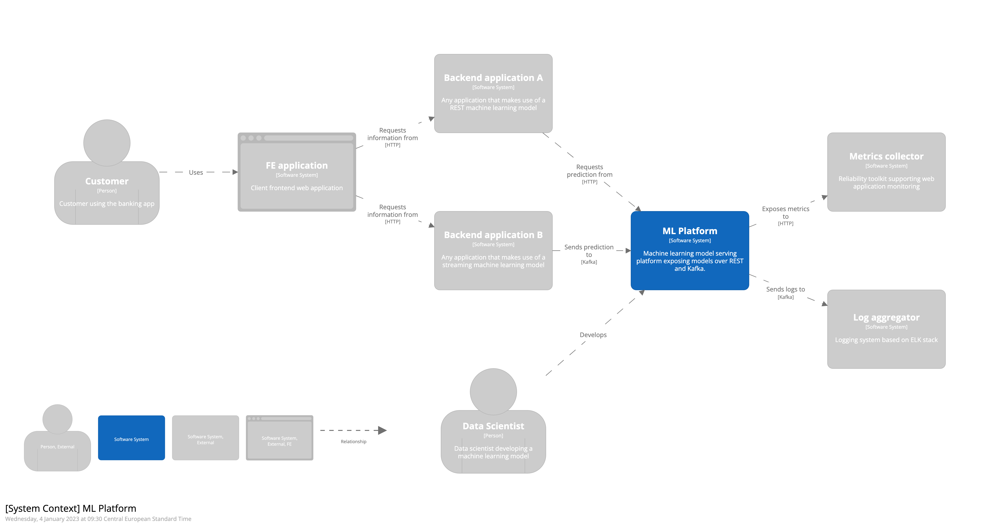
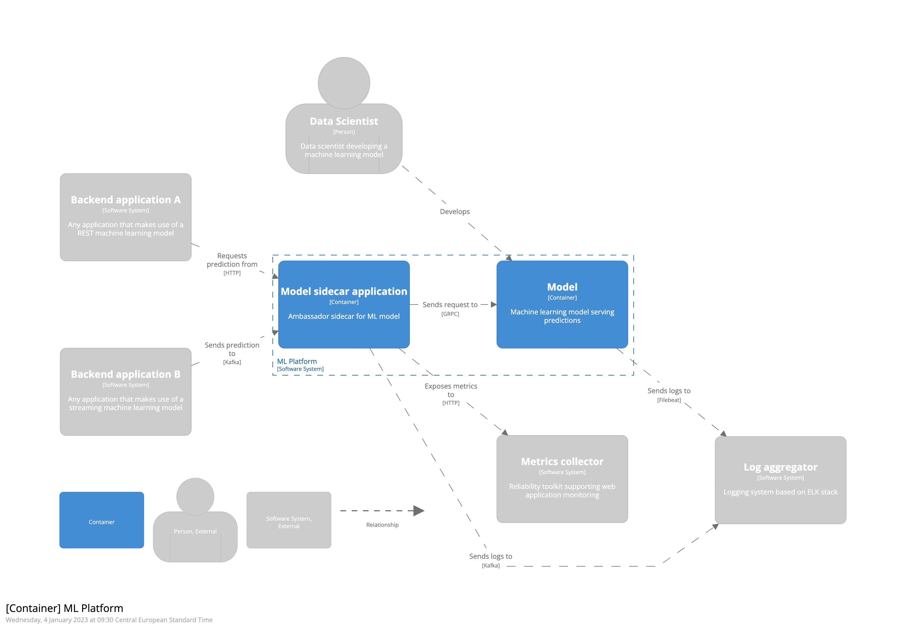
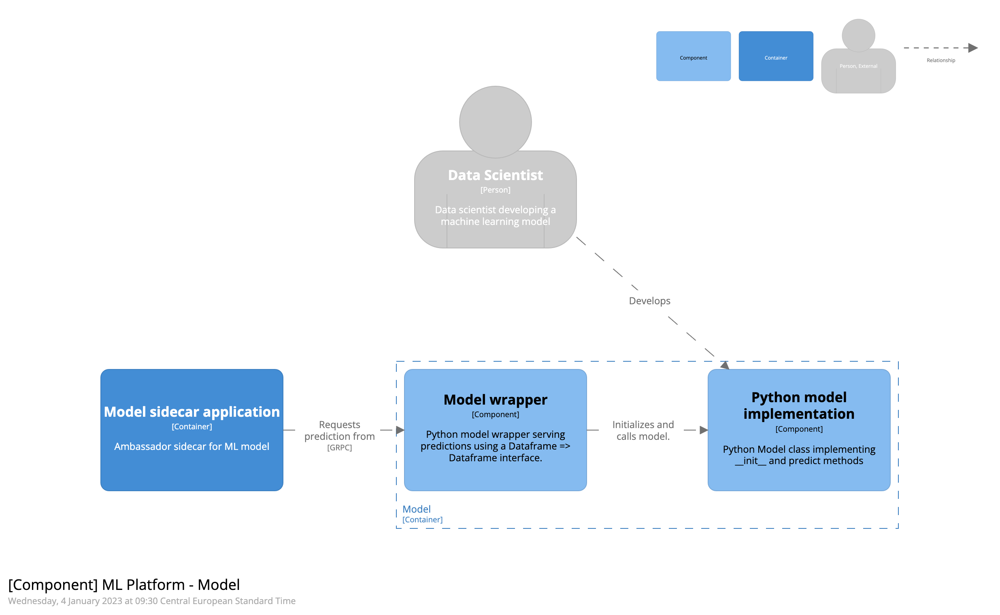

This repo was created as an example of how you can model your software architecture using the [C4 model](https://c4model.com/).
It makes use of the [Structurizr DSL](https://structurizr.com/).

The example architecture describes a Machine Learning model serving platform. 
It is by no means complete, but serves as an example of how to start creating a C4 model. The architecture describes the Context, Container and Component level.  
The example makes use of the DSL's basic functionality and some more advanced features.

# Context

# Container

# Component

