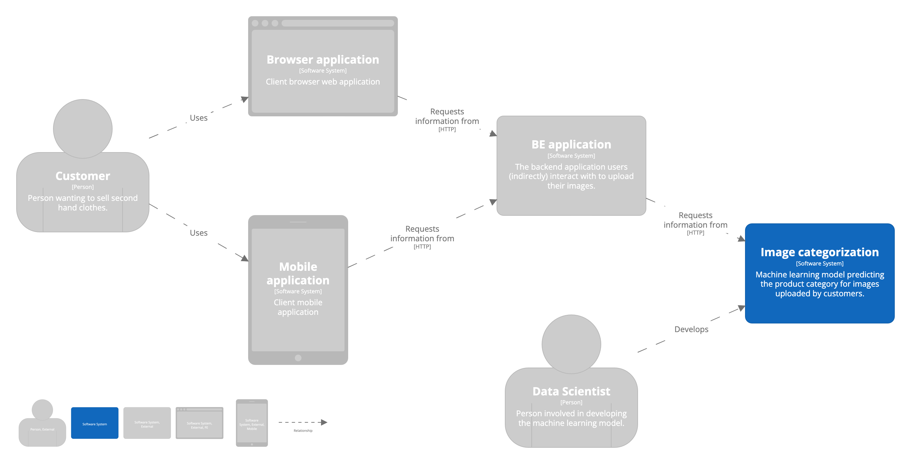

This repo was created as an example of how you can model your software architecture using the [C4 model](https://c4model.com/).
It makes use of the [Structurizr DSL](https://structurizr.com/).

This repository contains two examples.
It is by no means complete, but serves as an example of how to start creating a C4 model. The architecture describes the Context, Container and Component level.  
The example makes use of the DSL's basic functionality and some more advanced features.

- [Machine Learning model serving platform](#machine-learning-model-serving-platform)
- [Image classification use case](#image-classification)

## Machine Learning model serving platform
This example architecture describes a Machine Learning model serving platform. 

### Context

### Container

### Component

## Image classification
This example shows the architecture diagram of an image classification machine learning model.

### Context

